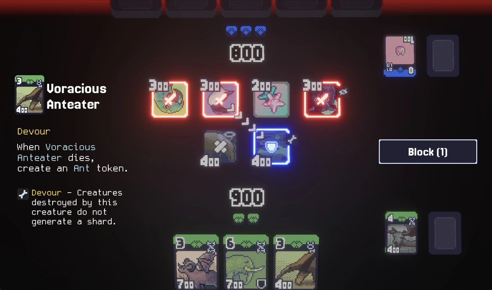

# Kodecks

[](https://github.com/kodecks/kodecks/actions/workflows/test.yml)

Open-source Classic-Style Digital Card Game



- Inspired by traditional TCGs such as MTG but featuring more streamlined gameplay
- Play in the browser or on desktop
- Battle against CPU or other players
- Localization support

## Build from source

You need to have Rust toolchain installed. You can install it from [rustup.rs](https://rustup.rs/).

```bash
git clone https://github.com/kodecks/kodecks.git
cd kodecks

scripts/download.sh # Download assets
# scripts\download.ps1 # For Windows PowerShell

cargo run
```

For WASM build, you need to have `wasm32-unknown-unknown` target installed.

```bash
rustup target install wasm32-unknown-unknown
cargo binstall trunk
trunk serve
```

## License

Source code and assets are licensed under the [MIT License](LICENSE-MIT.md) unless otherwise specified.

The server program (kodecks-server) is licensed under the [GNU Affero General Public License v3.0](kodecks-server/LICENSE-AGPL3.md).

[Fonts](https://github.com/kodecks/assets/tree/main/fonts) are licensed under the Open Font License or the Apache License.